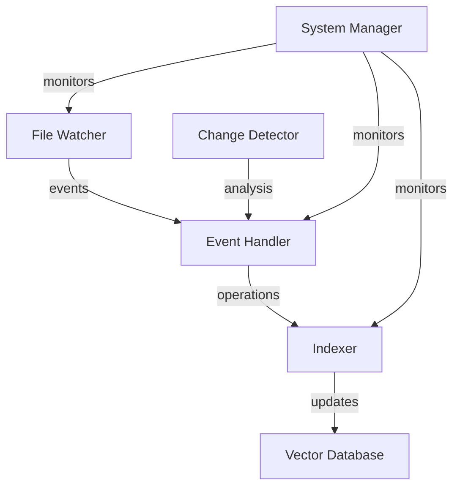

# File Synchronization Implementation Plan

This document outlines the implementation plan for enhancing the indexer with real-time file synchronization capabilities, including handling file modifications and deletions.

## Overview

Currently, the indexer only adds new files but does not handle modifications or deletions. This implementation will add a file watcher service and corresponding handlers to maintain synchronization between the file system and the vector database.

## Components

1. File Watcher Service
2. Event Handlers
3. Database Operations
4. Testing Framework

## Implementation Milestones

### Milestone 1: File Watcher Implementation
**Goal**: Implement a reliable file watcher service that detects file system changes in real-time.

Tasks:
1. Create FileWatcher class using watchdog library
   - [ ] Basic event detection for create/modify/delete
   - [ ] Filter for supported file extensions
   - [ ] Debounce mechanism for rapid changes
   - [ ] Integration with async event loop

Test Criteria:
- Create a test file → Verify event triggered
- Delete a test file → Verify event triggered
- Modify a test file → Verify event triggered
- Multiple rapid changes → Verify proper debouncing
- Verify correct file extension filtering

### Milestone 2: Event Handler System
**Goal**: Implement handlers for different file events that coordinate with the indexer.

Tasks:
1. Create EventHandler class
   - [ ] Handler for file creation events
   - [ ] Handler for file modification events
   - [ ] Handler for file deletion events
   - [ ] Event queue management
   - [ ] Error handling and retry logic

Test Criteria:
- Events properly queued
- Handlers execute in correct order
- Failed operations are retried
- Error states are properly logged
- Events are not lost on system restart

### Milestone 3: Database Operations
**Goal**: Implement database operations for updating and removing records.

Tasks:
1. Enhance Indexer class
   - [ ] Method to remove documents by file path
   - [ ] Method to update existing documents
   - [ ] Method to verify document existence
   - [ ] Batch operation support
   - [ ] Transaction support for atomic operations

Test Criteria:
- Delete record → Verify removal from database
- Update record → Verify old version removed and new version added
- Batch operations → Verify atomic completion
- Failed transaction → Verify proper rollback

### Milestone 4: Change Detection System
**Goal**: Implement smart change detection to minimize unnecessary updates.

Tasks:
1. Create ChangeDetector class
   - [ ] File hash calculation
   - [ ] Metadata comparison
   - [ ] Cache for recent file states
   - [ ] Optimization for large files

Test Criteria:
- No changes → Verify no unnecessary updates
- Content change only → Verify update triggered
- Metadata change only → Verify update triggered
- Large file handling → Verify performance within bounds

### Milestone 5: Integration and Recovery
**Goal**: Ensure system reliability and data consistency.

Tasks:
1. Create SystemManager class
   - [ ] Startup consistency check
   - [ ] Recovery from interrupted operations
   - [ ] Periodic consistency validation
   - [ ] Performance monitoring

Test Criteria:
- System crash → Verify recovery
- Inconsistent state → Verify detection and correction
- Performance degradation → Verify detection and alerting

## Component Relationships



## Technical Specifications

### File Watcher Configuration
```python
WATCHER_CONFIG = {
    'ignore_patterns': ['*.tmp', '~*'],
    'debounce_seconds': 2.0,
    'recursive': True,
    'supported_extensions': ['.md', '.txt', '.pdf', '.docx']
}
```

### Event Handler Queue
```python
EVENT_QUEUE_CONFIG = {
    'max_size': 1000,
    'batch_size': 10,
    'retry_attempts': 3,
    'retry_delay': 1.0
}
```

### Change Detection
```python
CHANGE_DETECTION_CONFIG = {
    'cache_size': 1000,
    'hash_algorithm': 'xxhash64',
    'large_file_threshold': 10_000_000,  # 10MB
    'metadata_fields': ['modified_time', 'size', 'permissions']
}
```

## Implementation Phases

1. **Phase 1** (Weeks 1-2)
   - Implement File Watcher
   - Basic event detection
   - Initial testing framework

2. **Phase 2** (Weeks 3-4)
   - Event Handler implementation
   - Queue management
   - Integration with existing indexer

3. **Phase 3** (Weeks 5-6)
   - Database operations
   - Change detection system
   - Performance optimization

4. **Phase 4** (Weeks 7-8)
   - System management
   - Recovery mechanisms
   - Full integration testing

## Testing Strategy

### Unit Tests
- Individual component functionality
- Edge case handling
- Error conditions

### Integration Tests
- Component interaction
- System-wide operations
- Performance benchmarks

### Stress Tests
- High volume operations
- Concurrent modifications
- System recovery

### Consistency Tests
- Data integrity verification
- State synchronization
- Recovery validation

## Success Criteria

1. File system changes reflect in search results within 5 seconds
2. Zero data loss during normal operations
3. System recovers from crashes without manual intervention
4. CPU usage remains below 10% during idle
5. Memory usage remains stable during extended operation
6. All tests pass with >95% coverage

## Future Enhancements

1. Configurable consistency checks
2. Advanced conflict resolution
3. Remote file system support
4. Distributed operation support
5. Custom event handlers for specific file types